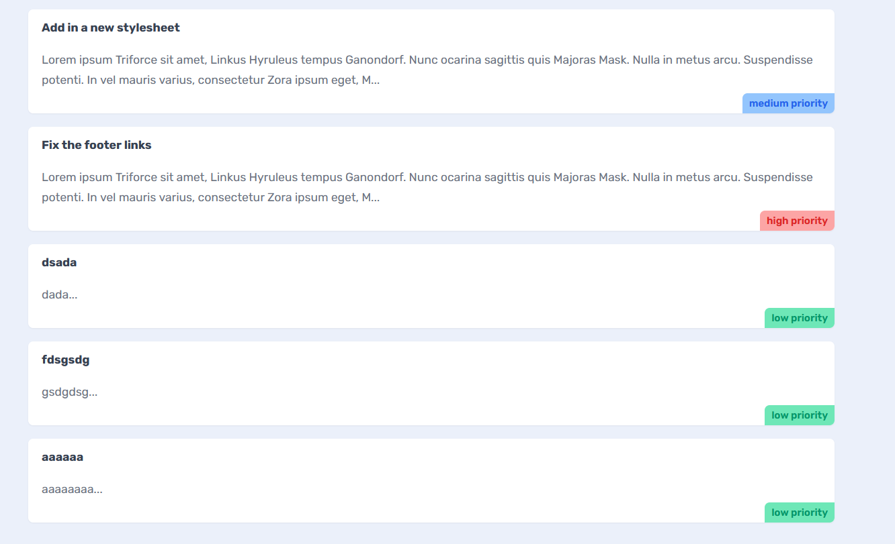

# Summary

I was able to add tickets:

Learned to use `useRouter`, to define a form using `label`, `select`, `option`, `span`. To define a component as client side for interaction; `'use client';` and practiced doing `POST` fetch.
