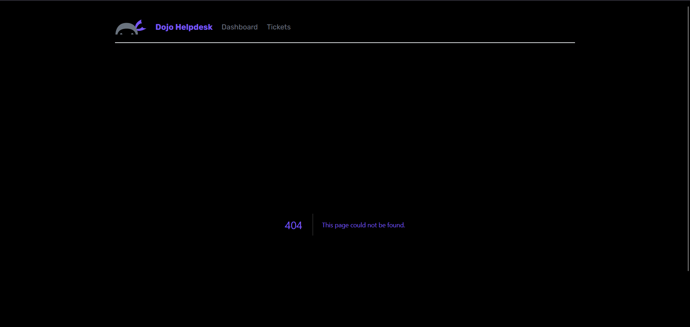

## Summary

Dynamic routes can export a `generateStaticParams` which tells next to do static render of the routes based on each element of the output array, which are objects that contain the dynamic parameter name as single property and the name of the route to generate. So for example for `{ id: 4 }` it will generate `tickets/4`.

I can also export a variable called dynamicParams to turn on or off the dynamic page generation.

Finally, there is a `notFound()` function that when called it means that the route resulted in a 404.

One strange thing is that my version of 404 is black:

