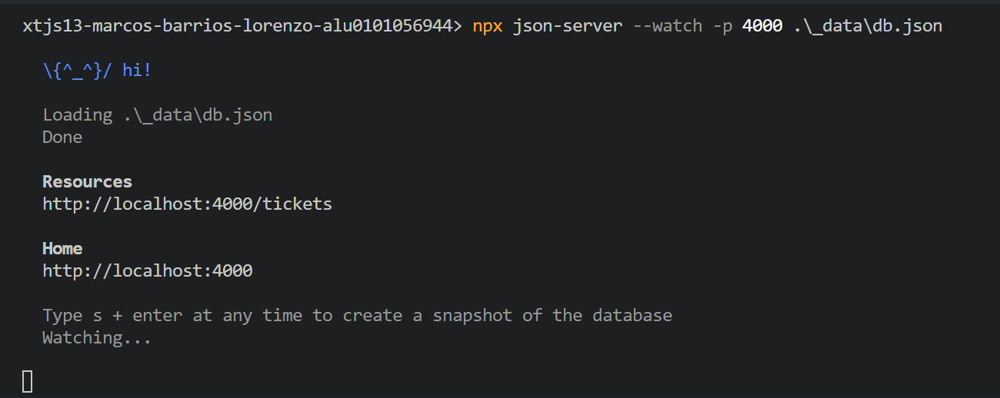
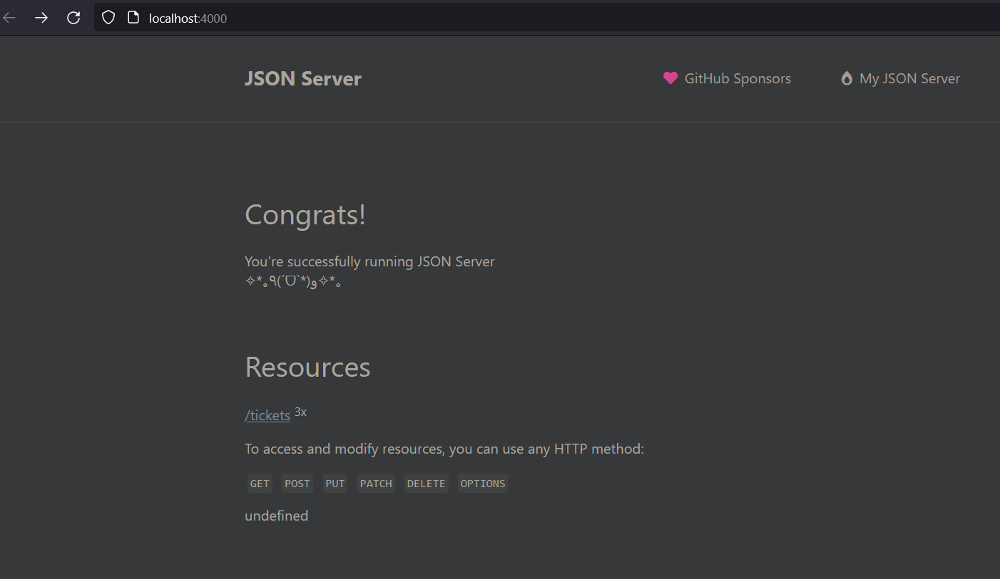

# Summary of my experience

`json-server` is very useful for mockingn a dabatase:

## Annotations

 - When a data is fetched, the data will be fetched once even if it was fetched twice on teh source code. It is also cached. And that is important to know because overtime the data will change but the webpage will have outdated data. That is why next checks a `next` propety within a `fetch` second argument's object and will check if there is a `validate` property that has a number that is the seconds passed until a new data request is done instead of using the cached data after the first data fetch. **If validate is set to 0 then the data will never be cached**.

 - When I create a `[<myString>]` directory then it means that it is a dynamic route and the `page.jsx` within will receive as a params prop named after the dynamic folder's name, `params.<myString>`, the actual route name.

 - The `json-server` makes available each json element as a separate route. for example: `localhost:4000/tickets/2` for the tickets. 
