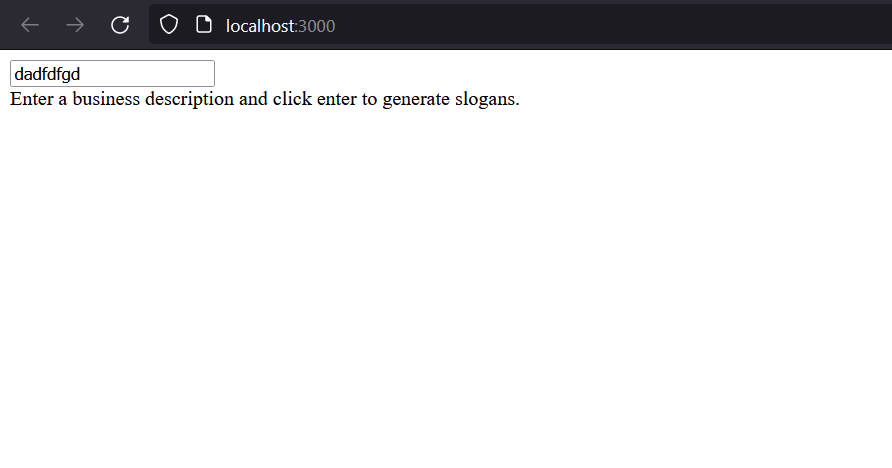
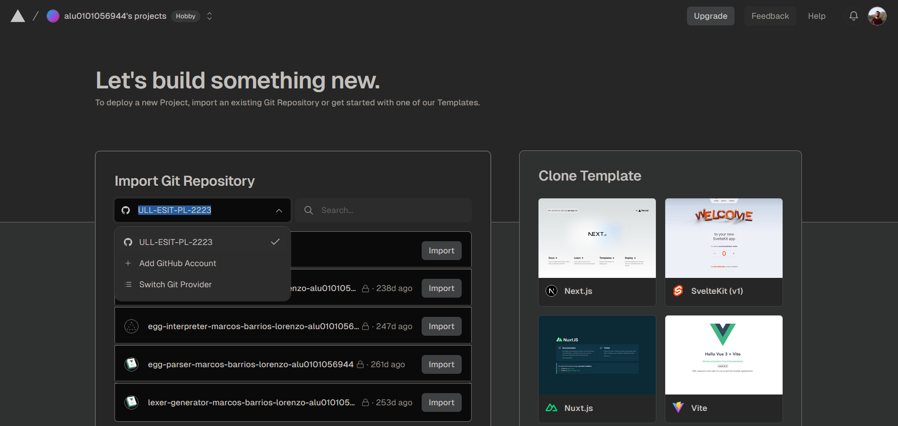

# Report

Marcos Barrios Lorenzo, alu0101056944@ull.edu.es

## About serverless functions

Serverless functions are functions the events that trigger the function to be executed while leaving the infrastructure to the serverless provider. That way the scalabiliy is automatically done without always-on compute.

## Edge runtime

There are CDN which store and directly serve computation results, and then there are edge servers, which can also run small snippets of code, giving support for live streaming and gaming.

The runtime itself defined the available libraries and general functionality available during the snippet's execution. Normally all the Node.js libraries are available, althought in Next.js it is actually a subset of them.

It is meant for delivering personalized content at low latency with small, simple functions.

## Route handlers

They are serverless functions that are called when a route is accessed, so within the `app/` folder an export named after an HTTP method will be a route handler:

```js
export async function GET() {
  const res = await fetch('https://data.mongodb-api.com/...', {
    headers: {
      'Content-Type': 'application/json',
      'API-Key': process.env.DATA_API_KEY,
    },
  })
  const data = await res.json()
 
  return Response.json({ data })
}
```

Because the `route.ts` file that contains that function is at `app/api/hello/` then it will handle the GET requests to that very route.

## Explaining [route.ts](../app/api/completion/route.ts)'s code

```js
const openai = new OpenAI({
  apiKey: process.env.OPENAI_API_KEY,
});
```

Instance an OpenAI API client that is edge friendly, which means that it allows for small personalization computation while streaming.

```js
export const runtime = 'edge';
```

Set the `edge` runtime on nextjs.

```js
export async function POST(req: Request) {
  const { prompt } = await req.json();
 
  // Ask OpenAI for a streaming completion given the prompt
  const response = await openai.completions.create({
    model: 'text-davinci-003',
    stream: true,
    temperature: 0.6,
    max_tokens: 300,
    prompt: `Create three slogans for a business with unique features.
 
Business: Bookstore with cats
Slogans: "Purr-fect Pages", "Books and Whiskers", "Novels and Nuzzles"
Business: Gym with rock climbing
Slogans: "Peak Performance", "Reach New Heights", "Climb Your Way Fit"
Business: ${prompt}
Slogans:`,
  });
  // Convert the response into a friendly text-stream
  const stream = OpenAIStream(response);
  // Respond with the stream
  return new StreamingTextResponse(stream);
}
```

The route handler expects the request to have a promp field. The prompt is taken and sent to OpenAI's `text-davinci-003` model after wrapping the original prompt. Then pass the reponse through a specialized stream object for OpenAI and finally make a packet with streaming that has as body the stream in plain text so that the client can receive it properly.

## Client UI

The main page, [app/page.tsx](../app/page.tsx) is a client side component with the following code:

```js
'use client'
 
import { useCompletion } from 'ai/react';
 
export default function SloganGenerator() {
  const { completion, input, handleInputChange, handleSubmit } = useCompletion();
 
  return (
    <div className="mx-auto w-full max-w-md py-24 flex flex-col stretch">
      <form onSubmit={handleSubmit}>
        <input
          className="fixed w-full max-w-md bottom-0 border border-gray-300 rounded mb-8 shadow-xl p-2 dark:text-black"
          value={input}
          placeholder="Describe your business..."
          onChange={handleInputChange}
        />
      </form>
      {completion ? (
        <div className="whitespace-pre-wrap my-4">{completion}</div>
      ) : (
        <div>Enter a business description and click enter to generate slogans.</div>
      )}
    </div>
  );
}
```

It is a form that uses a component for making AI Completion programs. `completion` has the string received from the remote AI. `input` is the user's current input. `handleInputChange` and `handleSubmit` are meant for a form.

According to the vercel SDK AI [streaming documentation](https://github.com/ULL-prompt-engineering/vercel-sdk-ai-quickstart/blob/main/docs/streaming.md), streaming is necessary for the user not to have to wait too many seconds for the UI to be able to respond to user input.

## Viewing the final webpage

After running `npm run dev` a local netjs development server is active at `http://localhost:3000/` and this is the result:



It is meant to automatically call the POST router at `api/completion/route.ts` on each typed character, but in this case an OpenAI key is missing so nothing happens.

## Deploying to vercel

Cannot deploy to vercel due to the organization not being authorized to use vercel:


